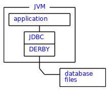
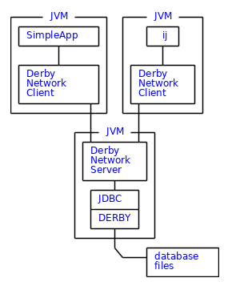
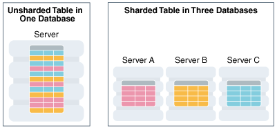
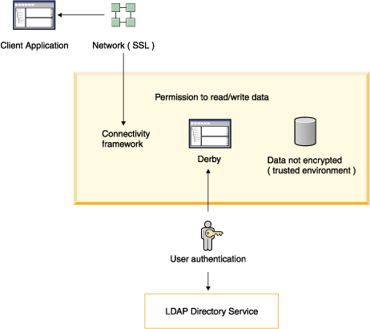
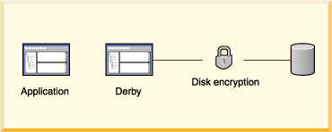

# Обзор реляционной СУБД Derby

## История и особенности Derby

Apache Derby - это легковесная реляционная база данных, предназначенная для встраивания в java приложения. 

* Apache Derby зародилась в компании Cloudscape Inc. Первый релиз, названный JBMS, был выпущен в 1997 году
* В 1999 году Informix Software, Inc. приобрела компанию Cloudscape, Inc.
* В 2001 году все разработки отошли IBM. СУБД  переименовали в IBM Cloudscape и продолжали выпускать, будучи 
ориентированной в основном на встроенное использование с Java-продуктами IBM
* В августе 2004 года IBM передала исходный код в Apache Software Foundation под именем Derby
* В июле 2005 года к проекту также присоединилась Sun с целью использования Derby как компонента своих продуктов и, 
начиная с релиза Java 6, в декабре 2006 года Sun начала поставлять Derby в составе JDK под именем Java DB.
* В марте 2007 года IBM объявила, что отказывается от поддержки продукта Cloudscape, но будет продолжать вносить свой 
вклад в проект Apache Derby.


С точки зрения скорости Derby проигрывает одному из своих основных конкуретнов, субд H2, которая однако имеет достаточно
ограниченный функционал и хранится в оперативной памяти.

Derby предназначена для Data Mining, может использовать в Data Warehousing и как ROLAP СУБД
### _Ключевые особенности_
* Derby легковесная - базовые файлы с функционалом весят порядка 3.5 MB
* Derby в своей основе использует java. JDBC и SQL - доступные api для взаимодействия
* Derby можно запускать как часть приложения на java при помощи "встроенного драйвера JDBC"
* Derby поддерживает стандартную схему обращения клиент-сервер

 JDBC - стандарт взаимодействия java-приложений с СУБД

## Устройство и принцип работы Derby Engine
1) Derby целиком написан на java. Все сервисы обеспечивающие работу derby являются java приложениями,
запускающимися внутри JVM. Так, по месту установки Derby можно найти следующие файлы:

* derby.jar - Derby engine, который также выступает в роли "Embedded Derby JDBC driver"
* derbytools.jar - инструменты для взаимодействия с бд
* схема "клиент-сервер"
  * derbynet.jar - серверная часть (Derby Network Server)
  * derbyclient.jar - клиентская часть (Network client JDBC driver)
* и д.р.

2) Вся информация о бд (таблицы, индексы, логи) хранится в файлах на диске

3) Derby engine работает в двух режимах Embedded и Client-Server 

### _Режим Embedded_


В режиме embedded Derby запускается внутри той же JVM что и использующее его java приложение. Таким образом Derby 
становится частью java приложения, которая осуществляет запросы к БД хранящейся в файлах на диске 

Пример: инструмент **ij** запускается как отдельное java приложение и использует JDBC для составления запросов к бд


### _Режим Client-Server_



В этом режиме приложение обращается к derby по схеме клиент–сервер. Derby Network Server запускается в 
отдельной jvm при помощи Embedded драйвера и обрабатывает входящие запросы от одного или нескольких клиентов
(будь то инструмент ij или некоторое приложение на java)


## Инструменты для взаимодействия

### _Команда sysinfo_
> Передназначение: выдаёт информацию об окружении

Запуск: `java org.apache.derby.tools.sysinfo`
```bash
------------------ Java Information ------------------
Java Version:    11.0.15
Java Vendor:     Private Build
Java home:       /usr/lib/jvm/java-11-openjdk-amd64
Java classpath:  /opt/Apache/db-derby-10.15.2.0-bin//lib/derby.jar:/opt/Apache/db-derby-10.15.2.0-bin//lib/derbytools.jar:/opt/Apache/db-derby-10.15.2.0-bin//lib/derbyoptionaltools.jar:/opt/Apache/db-derby-10.15.2.0-bin//lib/derbyshared.jar:.
OS name:         Linux
OS architecture: amd64
OS version:      5.13.0-40-generic
Java user name:  maksim
Java user home:  /home/maksim
Java user dir:   /home/maksim/Documents/MIPT/6sem/databases/hw4_Derby
java.specification.name: Java Platform API Specification
java.specification.version: 11
java.runtime.version: 11.0.15+10-Ubuntu-0ubuntu0.20.04.1
--------- Derby Information --------
[/opt/Apache/db-derby-10.15.2.0-bin/lib/derby.jar] 10.15.2.0 - (1873585)
[/opt/Apache/db-derby-10.15.2.0-bin/lib/derbytools.jar] 10.15.2.0 - (1873585)
[/opt/Apache/db-derby-10.15.2.0-bin/lib/derbynet.jar] 10.15.2.0 - (1873585)
[/opt/Apache/db-derby-10.15.2.0-bin/lib/derbyclient.jar] 10.15.2.0 - (1873585)
[/opt/Apache/db-derby-10.15.2.0-bin/lib/derbyshared.jar] 10.15.2.0 - (1873585)
[/opt/Apache/db-derby-10.15.2.0-bin/lib/derbyoptionaltools.jar] 10.15.2.0 - (1873585)
------------------------------------------------------
----------------- Locale Information -----------------
Current Locale :  [English/United Kingdom [en_GB]]
Found support for locale: [cs]
	 version: 10.15.2.0 - (1873585)
Found support for locale: [de_DE]
	 version: 10.15.2.0 - (1873585)
Found support for locale: [es]
	 version: 10.15.2.0 - (1873585)
Found support for locale: [fr]
	 version: 10.15.2.0 - (1873585)
Found support for locale: [hu]
	 version: 10.15.2.0 - (1873585)
Found support for locale: [it]
	 version: 10.15.2.0 - (1873585)
Found support for locale: [ja_JP]
	 version: 10.15.2.0 - (1873585)
Found support for locale: [ko_KR]
	 version: 10.15.2.0 - (1873585)
Found support for locale: [pl]
	 version: 10.15.2.0 - (1873585)
Found support for locale: [pt_BR]
	 version: 10.15.2.0 - (1873585)
Found support for locale: [ru]
	 version: 10.15.2.0 - (1873585)
Found support for locale: [zh_CN]
	 version: 10.15.2.0 - (1873585)
Found support for locale: [zh_TW]
	 version: 10.15.2.0 - (1873585)
------------------------------------------------------
------------------------------------------------------
```

### _ij_

> Передназначение: консоль для управления базой данных на derby

`java org.apache.derby.tools.ij` - открывает консоль для взаимодействия с БД

`connect 'jdbc:derby:MyDbTest;create=true';` - первое подключение вместе с созданием БД

`connect 'jdbc:derby:/home/maksim/Documents/MIPT/6sem/databases/hw4_Derby/MyDbTest';` - подключение к существующей бд 
осуществляется через указания пути, по которому храняться файлы с данными

Через консоль можно выполнять любые команды для работы с derby бд. Примеры можно посмотреть ниже.

### _dblook_
> Передназначение: описывает структуру базы данных через DDL запросы

Посмотрим на структуру демо БД toursdb

Запуск: `java org.apache.derby.tools.dblook -d jdbc:derby:$DERBY_INSTALL/demo/databases/toursdb`

```derby
-- Timestamp: 2022-05-03 22:52:47.13
-- Source database is: /opt/Apache/db-derby-10.15.2.0-bin/demo/databases/toursdb
-- Connection URL is: jdbc:derby:/opt/Apache/db-derby-10.15.2.0-bin/demo/databases/toursdb
-- appendLogs: false

-- ----------------------------------------------
-- DDL Statements for tables
-- ----------------------------------------------

CREATE TABLE "APP"."FLIGHTAVAILABILITY" ("FLIGHT_ID" CHAR(6) NOT NULL, "SEGMENT_NUMBER" INTEGER NOT NULL, "FLIGHT_DATE" DATE NOT NULL, "ECONOMY_SEATS_TAKEN" INTEGER DEFAULT 0, "BUSINESS_SEATS_TAKEN" INTEGER DEFAULT 0, "FIRSTCLASS_SEATS_TAKEN" INTEGER DEFAULT 0);

CREATE TABLE "APP"."MAPS" ("MAP_ID" INTEGER NOT NULL GENERATED ALWAYS AS IDENTITY (START WITH 1, INCREMENT BY 1), "MAP_NAME" VARCHAR(24) NOT NULL, "REGION" VARCHAR(26), "AREA" DECIMAL(8,4) NOT NULL, "PHOTO_FORMAT" VARCHAR(26) NOT NULL, "PICTURE" BLOB(102400));

CREATE TABLE "APP"."FLIGHTS_HISTORY" ("FLIGHT_ID" CHAR(6), "SEGMENT_NUMBER" INTEGER, "ORIG_AIRPORT" CHAR(3), "DEPART_TIME" TIME, "DEST_AIRPORT" CHAR(3), "ARRIVE_TIME" TIME, "MEAL" CHAR(1), "FLYING_TIME" DOUBLE, "MILES" INTEGER, "AIRCRAFT" VARCHAR(6), "STATUS" VARCHAR(20));

CREATE TABLE "APP"."AIRLINES" ("AIRLINE" CHAR(2) NOT NULL, "AIRLINE_FULL" VARCHAR(24), "BASIC_RATE" DOUBLE, "DISTANCE_DISCOUNT" DOUBLE, "BUSINESS_LEVEL_FACTOR" DOUBLE, "FIRSTCLASS_LEVEL_FACTOR" DOUBLE, "ECONOMY_SEATS" INTEGER, "BUSINESS_SEATS" INTEGER, "FIRSTCLASS_SEATS" INTEGER);

CREATE TABLE "APP"."CITIES" ("CITY_ID" INTEGER NOT NULL, "CITY_NAME" VARCHAR(24) NOT NULL, "COUNTRY" VARCHAR(26) NOT NULL, "AIRPORT" VARCHAR(3), "LANGUAGE" VARCHAR(16), "COUNTRY_ISO_CODE" CHAR(2));

CREATE TABLE "APP"."FLIGHTS" ("FLIGHT_ID" CHAR(6) NOT NULL, "SEGMENT_NUMBER" INTEGER NOT NULL, "ORIG_AIRPORT" CHAR(3), "DEPART_TIME" TIME, "DEST_AIRPORT" CHAR(3), "ARRIVE_TIME" TIME, "MEAL" CHAR(1), "FLYING_TIME" DOUBLE, "MILES" INTEGER, "AIRCRAFT" VARCHAR(6));

CREATE TABLE "APP"."COUNTRIES" ("COUNTRY" VARCHAR(26) NOT NULL, "COUNTRY_ISO_CODE" CHAR(2) NOT NULL, "REGION" VARCHAR(26));

-- ----------------------------------------------
-- DDL Statements for indexes
-- ----------------------------------------------

CREATE INDEX "APP"."ORIGINDEX" ON "APP"."FLIGHTS" ("ORIG_AIRPORT");

CREATE INDEX "APP"."DESTINDEX" ON "APP"."FLIGHTS" ("DEST_AIRPORT");

-- ----------------------------------------------
-- DDL Statements for keys
-- ----------------------------------------------

-- PRIMARY/UNIQUE
ALTER TABLE "APP"."CITIES" ADD CONSTRAINT "CITIES_PK" PRIMARY KEY ("CITY_ID");

ALTER TABLE "APP"."COUNTRIES" ADD CONSTRAINT "COUNTRIES_PK" PRIMARY KEY ("COUNTRY_ISO_CODE");

ALTER TABLE "APP"."COUNTRIES" ADD CONSTRAINT "COUNTRIES_UNQ_NM" UNIQUE ("COUNTRY");

ALTER TABLE "APP"."FLIGHTAVAILABILITY" ADD CONSTRAINT "FLIGHTAVAIL_PK" PRIMARY KEY ("FLIGHT_ID", "SEGMENT_NUMBER", "FLIGHT_DATE");

ALTER TABLE "APP"."FLIGHTS" ADD CONSTRAINT "FLIGHTS_PK" PRIMARY KEY ("FLIGHT_ID", "SEGMENT_NUMBER");

ALTER TABLE "APP"."MAPS" ADD CONSTRAINT "SQL0000000089-140d4147-0170-12de-1db1-ffffca414423" UNIQUE ("MAP_ID", "MAP_NAME");

ALTER TABLE "APP"."AIRLINES" ADD CONSTRAINT "AIRLINES_PK" PRIMARY KEY ("AIRLINE");

-- FOREIGN
ALTER TABLE "APP"."CITIES" ADD CONSTRAINT "COUNTRIES_FK" FOREIGN KEY ("COUNTRY_ISO_CODE") REFERENCES "APP"."COUNTRIES" ("COUNTRY_ISO_CODE") ON DELETE NO ACTION ON UPDATE NO ACTION;

ALTER TABLE "APP"."FLIGHTAVAILABILITY" ADD CONSTRAINT "FLIGHTS_FK2" FOREIGN KEY ("FLIGHT_ID", "SEGMENT_NUMBER") REFERENCES "APP"."FLIGHTS" ("FLIGHT_ID", "SEGMENT_NUMBER") ON DELETE NO ACTION ON UPDATE NO ACTION;

-- ----------------------------------------------
-- DDL Statements for checks
-- ----------------------------------------------

ALTER TABLE "APP"."COUNTRIES" ADD CONSTRAINT "COUNTRIES_UC" CHECK (country_ISO_code = upper(country_ISO_code) );

ALTER TABLE "APP"."FLIGHTS" ADD CONSTRAINT "MEAL_CONSTRAINT" CHECK (meal IN ('B', 'L', 'D', 'S'));

-- ----------------------------------------------
-- DDL Statements for triggers
-- ----------------------------------------------

CREATE TRIGGER "APP"."TRIG1" AFTER UPDATE ON "APP"."FLIGHTS" REFERENCING OLD AS UPDATEDROW FOR EACH ROW INSERT INTO "APP"."FLIGHTS_HISTORY" VALUES (UPDATEDROW.FLIGHT_ID, UPDATEDROW.SEGMENT_NUMBER, UPDATEDROW.ORIG_AIRPORT,UPDATEDROW.DEPART_TIME, UPDATEDROW.DEST_AIRPORT,UPDATEDROW.ARRIVE_TIME,UPDATEDROW.MEAL, UPDATEDROW.FLYING_TIME, UPDATEDROW.MILES, UPDATEDROW.AIRCRAFT,'INSERTED FROM TRIG1');

CREATE TRIGGER "APP"."TRIG2" AFTER DELETE ON "APP"."FLIGHTS" FOR EACH STATEMENT INSERT INTO "APP"."FLIGHTS_HISTORY" (STATUS) VALUES ('INSERTED FROM TRIG2');
```

## Язык запросов

В качестве языка для запросов в Derby используется SQL

### _Примеры запросов_
* Создание схемы
```derby
create schema hw4_derby;
```
* Создание таблицы
```derby
-- CREATE TABLE table_name (
--    column_name1 column_data_type1 constraint (optional),
--    column_name2 column_data_type2 constraint (optional),
--    column_name3 column_data_type3 constraint (optional)
-- );

create table hw4_derby.first_table(
    id integer primary key generated always as identity, -- auto increment
    name varchar(20) not null ,
    salary float not null ,
    birthdate date not null
);
```
* Вставка данных
```derby
-- INSERT INTO table_name VALUES (column_name1, column_name2, ...);

insert into hw4_derby.first_table(name, salary, birthdate) values ('Linus', 1000000.0, '1969-12-28');
insert into hw4_derby.first_table(name, salary, birthdate) values ('Alexandr', 100.42, '1799-05-26');
insert into hw4_derby.first_table(name, salary, birthdate) values ('Jotaro', 1000.4, '1970-01-01');
insert into hw4_derby.first_table(name, salary, birthdate) values ('Dima', 370000.0, '2001-01-18');
insert into hw4_derby.first_table(name, salary, birthdate) values ('Mark', 120000.0, '2001-11-07');
```
* Вывод содержимого таблицы
```derby
select * from hw4_derby.first_table;
```
| ID | NAME | SALARY | BIRTHDATE |
| :--- | :--- | :--- | :--- |
| 1 | Linus | 1000000 | 1969-12-28 |
| 2 | Alexandr | 100.42 | 1799-05-26 |
| 3 | Jotaro | 1000.4 | 1970-01-01 |
| 4 | Dima | 370000 | 2001-01-18 |
| 5 | Mark | 120000 | 2001-11-07 |
* Добавление столбца
```derby
-- ALTER TABLE table_name ADD COLUMN column_name column_type;

alter table hw4_derby.first_table add column height int;
```
| ID | NAME | SALARY | BIRTHDATE | HEIGHT |
| :--- | :--- | :--- | :--- | :--- |
| 1 | Linus | 1000000 | 1969-12-28 | NULL |
| 2 | Alexandr | 100.42 | 1799-05-26 | NULL |
| 3 | Jotaro | 1000.4 | 1970-01-01 | NULL |
| 4 | Dima | 370000 | 2001-01-18 | NULL |
| 5 | Mark | 120000 | 2001-11-07 | NULL |
* Удаление столбца
```derby
-- ALTER TABLE table_name DROP COLUMN column_name;

alter table hw4_derby.first_table drop column height;
```
* Обновление данных
```derby
-- UPDATE table_name
--    SET column_name = value, column_name = value, ...
--    WHERE conditions;

update hw4_derby.first_table set salary = 50.5 where birthdate < '1900-01-01';
```
| ID | NAME | SALARY | BIRTHDATE |
| :--- | :--- | :--- | :--- |
| 1 | Linus | 1000000 | 1969-12-28 |
| 2 | Alexandr | 50.5 | 1799-05-26 |
| 3 | Jotaro | 1000.4 | 1970-01-01 |
| 4 | Dima | 370000 | 2001-01-18 |
| 5 | Mark | 120000 | 2001-11-07 |
* Удаление данных
```derby
-- DELETE FROM table_name WHERE condition;

delete from hw4_derby.first_table where salary > 500000.0;
```
* Удаление таблицы
```derby
-- DROP TABLE table_name;

drop table hw4_derby.first_table;
```


### _Пример select запроса к демобазе tourdb_
Все самолёты вылетающие из аэропортов ('ABQ', 'LAX', 'PHX') и пролетающие в среднем больше 1000 миль за перелёт
```derby
select AIRCRAFT, avg(MILES) as avg_miles, min(MILES) as min_miles, max(MILES) as max_miles from APP.FLIGHTS
where ORIG_AIRPORT in ('ABQ', 'LAX', 'PHX', 'AKL', 'JFK')
group by AIRCRAFT
having avg(MILES) > 200
order by avg(MILES) desc;
```
| AIRCRAFT | AVG\_MILES | MIN\_MILES | MAX\_MILES |
| :--- | :--- | :--- | :--- |
| B747 | 2186 | 329 | 6161 |
| B767 | 347 | 347 | 347 |

### _Пример взаимодействие с Derby через стандарт JDBC_

```java
import java.sql.Connection;
import java.sql.DriverManager;
import java.sql.Statement;
import java.sql.ResultSet;
public class WhereClauseExample {
   public static void main(String args[]) throws Exception {
      // Регистрируем драйвер для работы в режиме Embedded
      Class.forName("org.apache.derby.jdbc.EmbeddedDriver");
      
      // Получаем объект соединения (conn), через который осуществляется взаимодействие с БД
      String URL = "jdbc:derby:sampleDB;create=true";
      Connection conn = DriverManager.getConnection(URL);

      // Через conn получаем объект запроса
      Statement stmt = conn.createStatement();

      // Формируем запросы в виде строки
      String query = "create table first_table("
         + "id integer primary key generated always as identity ,"
         + "name varchar(20) not null ,"
         + "salary float not null ,"
         + "birthdate date not null";
      // Выполняем запрос
      stmt.execute(query);
      
      String query = "insert into first_table(name, salary, birthdate) values "
         + "('Linus', 1000000.0, '1969-12-28'), "
         + "('Alexandr', 100.42, '1799-05-26'), "
         + "('Jotaro', 1000.4, '1970-01-01'), "
         + "('Dima', 370000.0, '2001-01-18'), "
         + "('Mark', 120000.0, '2001-11-07') ";
      stmt.execute(query);
      
      // executeQuery - нужен для сохранения результата select-а в переменную
      String query = "select * from first_table where salary > 400000.0;";
      ResultSet rs = stmt.executeQuery(query);
      while(rs.next()) {
         System.out.println("id: "+rs.getString("id"));
         System.out.println("name: "+rs.getString("name"));
         System.out.println("salary: "+rs.getString("salary"));
         System.out.println("birthdate: "+rs.getString("birthdate"));
         System.out.println(" ");
      }
   }
}
```

## Индексы
Формат создания индекса `CREATE (UNIQUE) INDEX index_name on table_name (column_name1, column_name2, ...);`

### _Типы индексов_

* Обычный индекс
```derby
create index salary_index on hw4_derby.first_table (salary);
```
* Индекс с запретом дублирования - после создания unique индекса на столбец при попытке добавить в этот столбец 
повторяющееся значение получим ошибку
```derby
create unique index name_index on hw4_derby.first_table (name);

insert into hw4_derby.first_table(name, salary, birthdate) values ('Mark', 42.42, '2042-04-07');

-- [23505][30000] The statement was aborted because it would have caused a duplicate key value in a unique
-- or primary key constraint or unique index identified by 'NAME_INDEX' defined on 'FIRST_TABLE'.
```
* Композитный индекс
```derby
create index salary_birth_index on hw4_derby.first_table (salary, birthdate);
```

Индексы можно создать для всех типов данных за исключением BLOB (binary large object) и LONGVARCHAR 

## План запросов
Select запрос выполняется в следующем порядке:

1) from - определяет бд для которой делается select и соответсвующие ей индексы
2) where - отсеивает часть строк по определённому условию
3) group by - группирует данные по столбцам
4) having - отсеивает группы данных по агрегированному условию (avg, max, min и т.д.)
5) orderby - сортирует итоговые строки

## Транзакции

В derby в рамках одной транзакции могут быть сразу SDL (schema manipulation statements) и DML запросы. Например в рамках одной транзакции может быть
создана таблица и тут же в неё что-то вставлено 


### _Когда Auto-Commit отключён_
В java приложении клиент получает доступ к БД при помощи объекта "connection". Через "connection" можно выполнять 
commit() и rollback(), чтобы осуществить и отменить транзакцию соответственно  

_**Отключение auto-сommit:**_ `conn.setAutoCommit(false);`

### _Когда Auto-Commit включён_
Если текущий запрос завершается или начинается новый запрос, то автоматически осуществляется транзакция с исходным
запросом


## Методы логирования и восстановления

Информация которую Derby использует для восстановления
* **Бекап базы данных**
* **Архивные логи** - используются для того чтобы восстановить базу оказавшуюся в неконсистентном состоянии (crash recovery)
* **Активные логи** - логи необходимые для roll-forward восстановления

Логи храняться в папке log вместе с остальными файлами базы данных и используются для восстановления БД в случае
аварийных ситуаций

### _Roll-forward восстановление_
Используя бекап БД, архивные логи до момента бекапа и последние активные логи, Roll-forward восстановление запускает
для последнего бекапа БД нужные транзакции записанные в логах. Таким образом БД восстанавливается вплоть до самых
последних изменений

_**Замечание:**_ восстанавливается целиком вся база данных, а не отдельные таблицы

### _Команды для логирования и восстановления:_
> Включить архивацию логов: `SYSCS_UTIL.SYSCS_BACKUP_DATABASE_AND_ENABLE_LOG_ARCHIVE_MODE
(IN BACKUPDIR VARCHAR(32672), IN SMALLINT DELETE_ARCHIVED_LOG_FILES)`
> 
> Отключить архивацию логов: `SYSCS_UTIL.SYSCS_DISABLE_LOG_ARCHIVE_MODE(IN SMALLINT DELETE_ARCHIVED_LOG_FILES )`
> 
> Сделать бекап БД: `CALL SYSCS_UTIL.SYSCS_BACKUP_DATABASE_AND_ENABLE_LOG_ARCHIVE_MODE (<PATH>, 0);`
> 
> Roll-forward восстановление: `connect 'jdbc:derby:derbydb;rollForwardRecoveryFrom=<PATH>';`


## Шардинг

Шардирование обеспечивается на уровне java-приложения использующего Derby. JDBC поддерживает горизонтальный шардинг,
когда строки одной большой бд распределяются в несколько малых бд



Подключение к распределённой бд в JDBC осуществляется в несколько шагов:
1) Построение шардинг ключа
2) Построение супер шардинг ключа (обычно строится на основании региона пользователя)
3) Подключение к шарду по данным ключам

```java
import oracle.jdbc.OracleShardingKey;
import oracle.jdbc.OracleType;
import oracle.jdbc.pool.OracleDataSource;

OracleDataSource ods = new OracleDataSource();
ods.setURL(url);
ods.setUser(user);
ods.setPassword(pwd);

// 1. Построение шардинг ключа
Date shardingKeyVal = new java.sql.Date(0L);
OracleShardingKey shardKey = 
  ods.createShardingKeyBuilder()
     .subkey(shardingKeyVal, OracleType.DATE)
     .build();

// 2. Построение супер шардинг ключа (опциональный шаг)
OracleShardingKey superShardKey =
  ods.createShardingKeyBuilder()       
     .subkey("Customer_Location_US”,oracle.jdbc.OracleType.VARCHAR2) 
     .build();

// 3. Подключение к шарду на основе полученных ключей
Connection conn = ods.createConnectionBuilder()
                     .shardingKey(shardKey)
                     .suerShardingKey(superShardKey)
                     .build();
```

## Безопасность

* **Аунтефикация пользователя:** Derby проверяет имя и пароль пользователя перед тем как предоставить ему доступ к базе данных
* **Авторизация пользователя:** каждому пользователю могут быть выданы различные права на чтение или запись в базу
* **Шифрование диска:** данные могут храниться на диске в зашифрованном виде
* **Проверка сертификата для подписанных jar файлов:** derby проверяет сертификат у классов загруженных из подписанных 
jar файлов
* **Сетевое шифрование и аутентификация:** трафик между клиентом и сервером может быть зашифрован с использованием SSL/TLS. Также 
поддерживается проверка подлинности по сертификату SSL/ TLS. 

### _Примеры_

На первой картинке изображён механизмы безопасности Derby, работающие в режиме клиент-сервер.
* Аутентификация пользователя выполняется через LDAP протокол (Lightweight Directory Access Protocol)
* После аунтификации и авторизации пользователь получает доступ в незашифрованным данным
* Трафик между БД и приложением шифруется при помощи SSL

_Картинка 1_



---

Механизм шифрования диска, изображённый на 2 картинке, может быть полезен для режима работы Embedded, когда получатель
не знает как защитить данные

_Картинка 2_




Полезные ссылки:

[Официальный туториал](https://db.apache.org/derby/papers/DerbyTut/index.html)

[Документация](https://db.apache.org/derby/manuals/index.html)

[Getting started](https://db.apache.org/derby/docs/10.15/getstart/index.html)

[Сайт с разбором базового функционала](https://www.tutorialspoint.com/apache_derby/index.htm)

[Демобаза](http://svn.apache.org/repos/asf/db/derby/code/trunk/java/demo/toursdb/toursdb_readme.html)